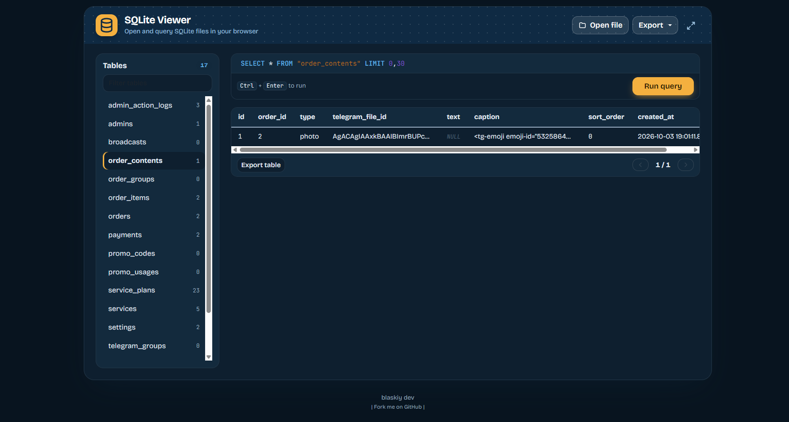

SQLite Viewer https://blaskiy.github.io/SQLiteViewer/
============

*View SQLite files in the browser. Nothing is uploaded: everything runs locally with [sql.js](https://github.com/sql-js/sql.js).*

Load a remote file (the server must send `Access-Control-Allow-Origin: *`):
`index.html?url=http://example.com/data.sqlite`

